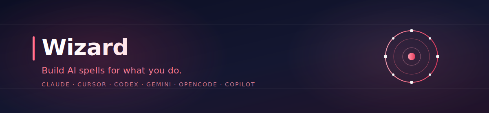

<p align="center">
  
</p>

<h3 align="center">Build AI spells for what you do.</h3>

<p align="center">
  Your AI wizard — every task you do twice becomes a spell you can cast in any tool. <br/>
  Runs in <strong>Claude Code</strong>, <strong>Cursor</strong>, <strong>Codex</strong>, <strong>Gemini</strong>, <strong>OpenCode</strong>, and <strong>Copilot CLI</strong>.
</p>

<p align="center">
  <a href="LICENSE"></a>
  
  
  
  
</p>

<p align="center">
  <sub>
    <b>25</b> spells &nbsp;·&nbsp;
    <b>12</b> framework skills &nbsp;·&nbsp;
    <b>12</b> workflow shapes &nbsp;·&nbsp;
    <b>6</b> AI tools &nbsp;·&nbsp;
    <b>0</b> telemetry
  </sub>
</p>

<p align="center">
  <sub>
    Maintained by <a href="https://redhuntlabs.com/"><b>RedHunt Labs</b></a>
  </sub>
</p>

<p align="center">
  
</p>

<p align="center">
  <a href="#install">Install</a> &nbsp;·&nbsp;
  <a href="#your-first-5-minutes">Quick start</a> &nbsp;·&nbsp;
  <a href="#whats-in-the-box">Library</a> &nbsp;·&nbsp;
  <a href="#slash-commands">Commands</a> &nbsp;·&nbsp;
  <a href="#documentation">Docs</a>
</p>

---

## What it is

Your AI assistant is good at one-off tasks. It is **much better** when you give it a recipe to follow.

Wizard gives you three things:

> **A spellbook** of 25+ ready-to-use spells — for emails, research, decisions, planning, status updates, dev workflows, and more.
>
> **A meta-builder** that interviews you and turns your recurring tasks into your own spells, saved to a personal library.
>
> **Capture a chat that worked** — `/capture-this-chat` reads the current AI session and turns it into a draft spell in one command. Or use `/build-spell --from-transcript <path>` for a saved transcript from any source.
>
> **A multi-tool plugin** that runs the same skills in every major AI coding tool — install once, use anywhere.

## Why it exists

| Problem | What this fixes |
|---|---|
| You re-explain the same task to the AI every time | Spells are reusable recipes the AI loads automatically |
| Prompts work in one tool, break in another | One skill format runs in 6 different AI tools |
| The AI is great at code but useless at *your* work | Spells cover research, writing, decisions, daily tasks |
| You want the AI to follow a discipline (no shipping without tests, no citing without verifying) | Discipline-kind spells enforce non-negotiable rules with hard gates |
| You hand-write the same workflow as a system prompt over and over | The meta-builder interviews you once and ships a tested spell |

## Is this for you?

| If you are... | You probably want... |
|---|---|
| **A researcher / writer / analyst** | The `research/` track — `literature-scan`, `interview-synthesis`, `verifying-before-citing`, and the `general-research-loop` chain |
| **A knowledge worker** | The `work/` track — `preparing-for-a-meeting`, `writing-a-status-update`, `responding-to-feedback` |
| **An everyday user** | The `everyday/` track — `writing-an-email`, `summarizing-a-document`, `planning-a-trip`, `troubleshooting-whats-not-working` |
| **A developer** | The `dev/` track — `brainstorming-a-feature`, `writing-an-implementation-plan`, `executing-a-plan-step-by-step`, plus the `dev-tdd-loop` chain |
| **Building a custom workflow** | The meta-builder. Type `/build-spell` and answer 5-15 minutes of questions. |

Tailored 5-minute intros: [for-non-devs.md](docs/for-non-devs.md) · [for-devs.md](docs/for-devs.md)

---

## Install

Pick the AI tool you already use. Each install is one or two commands.

> **Quickest path (Claude Code or Copilot CLI):**
> ```
> /plugin marketplace add redhuntlabs/wizard
> /plugin install wizard@wizard
> ```
> Other tools below.

<details>
<summary><b>Claude Code</b></summary>

**Recommended (one command, no clone needed):**

```
/plugin marketplace add redhuntlabs/wizard
/plugin install wizard@wizard
```

**Or install from a local clone:**

```bash
git clone https://github.com/redhuntlabs/wizard.git
```

```
/plugin install <path-to-cloned-repo>
```

The boot skill loads automatically via [hooks/hooks.json](hooks/hooks.json) on every session start.
</details>

<details>
<summary><b>Cursor</b></summary>

```bash
git clone https://github.com/redhuntlabs/wizard.git
```

In Cursor: `Settings → Plugins → Install from path` → select the cloned folder.

The descriptor lives at [.cursor-plugin/plugin.json](.cursor-plugin/plugin.json).
</details>

<details>
<summary><b>Codex CLI</b></summary>

```bash
git clone https://github.com/redhuntlabs/wizard.git ~/wizard
cd ~/wizard && npm install
```

Add to `~/.codex/AGENTS.md`:

```markdown
@~/wizard/AGENTS.md
```

Full instructions: [.codex/INSTALL.md](.codex/INSTALL.md)
</details>

<details>
<summary><b>Gemini CLI</b></summary>

```bash
gemini extensions install <path-to-cloned-repo>
```

Tool-name mapping: [GEMINI.md](GEMINI.md). Descriptor: [gemini-extension.json](gemini-extension.json).
</details>

<details>
<summary><b>OpenCode</b></summary>

In `opencode.json`:

```json
{
  "plugins": ["<path-to-cloned-repo>/.opencode/plugins/wizard.js"]
}
```

Full instructions: [.opencode/INSTALL.md](.opencode/INSTALL.md)
</details>

<details>
<summary><b>GitHub Copilot CLI</b></summary>

**Recommended (one command, no clone needed):**

```bash
copilot plugin marketplace add redhuntlabs/wizard
copilot plugin install wizard@wizard
```

**Fallback (older Copilot CLI without plugin support):** clone the repo and add to your project's or home directory's `AGENTS.md`:

```markdown
@<path-to-cloned-repo>/AGENTS.md
```

Then ensure scripts are runnable: `cd <path-to-cloned-repo> && npm install`. If slash commands aren't supported in your version, ask in plain English: "build a spell for me."
</details>

---

## Your first 5 minutes

**1. Cast a bundled spell.**

```
Cast the writing-an-email spell to draft a reply to my landlord
saying I'll be 3 days late on rent because of a paycheck delay.
```

**2. Build your own.**

```
/build-spell
```

The meta-builder interviews you (5-15 minutes), drafts a SKILL.md, runs a try-it test, and saves it to `~/.wizard/`.

**3. Browse what shipped.**

```
/list-spells
```

Filter by `--kind discipline`, `--audience researcher`, or `--updates`.

---

## What's in the box

<table>
<tr>
<td valign="top" width="33%">

### 🌱 Everyday

<sub>For anyone, any day.</sub>

- writing-an-email
- summarizing-a-document
- planning-a-trip
- troubleshooting-whats-not-working
- asking-for-feedback

</td>
<td valign="top" width="33%">

### 💼 Work

<sub>Knowledge-worker essentials.</sub>

- researching-a-company
- preparing-for-a-meeting
- writing-a-status-update
- responding-to-feedback
- wrapping-up-a-piece
- verifying-before-shipping <em>(discipline)</em>

</td>
<td valign="top" width="33%">

### 🧠 Thinking

<sub>For making harder calls.</sub>

- making-a-decision
- breaking-down-a-problem
- learning-something-new
- decisions-need-an-alternative <em>(discipline)</em>

</td>
</tr>
<tr>
<td valign="top">

### 🔬 Research

<sub>Citation-rigorous workflows.</sub>

- literature-scan
- interview-synthesis
- structured-literature-review
- verifying-before-citing <em>(discipline)</em>
- researching-five-things-in-parallel <em>(subagent)</em>

</td>
<td valign="top">

### ⚙️ Dev

<sub>For shipping software.</sub>

- brainstorming-a-feature
- writing-an-implementation-plan
- executing-a-plan-step-by-step

</td>
<td valign="top">

### 🔗 Chains

<sub>Multi-stage, end-to-end.</sub>

- general-research-loop
- dev-tdd-loop

</td>
</tr>
</table>

**25 hand-crafted spells + 12 framework skills + 12 workflow shapes** — all in [`spells/`](spells/) and [`skills/`](skills/).

---

## Slash commands

| Command | What it does |
|---|---|
| `/build-spell` | Interview-driven meta-builder. Routes to the right specialist by `kind`. Now supports `--from-transcript <path>`. |
| `/capture-this-chat` | Turn the current chat session into a reusable spell. See [`docs/capturing-chats.md`](docs/capturing-chats.md). |
| `/cast-spell <name>` | Cast a specific spell on the current task |
| `/list-spells` | Browse the spellbook. Filters: `--kind`, `--audience`, `--updates` |
| `/refine-spell <name>` | Update an existing spell (mandatory re-test) |
| `/share-spell <name>` | Export. Modes: `--strict` (vanilla SKILL.md), `--bundle` (zip) |

---

## Documentation

> **Start here:** [for-non-devs.md](docs/for-non-devs.md) or [for-devs.md](docs/for-devs.md)

| Topic | Doc |
|---|---|
| Why behavioral engineering, the 1% rule, the Iron Law | [philosophy.md](docs/philosophy.md) |
| `kind`, `complexity`, `audience` — picking the right shape | [taxonomy.md](docs/taxonomy.md) |
| The SKILL.md format spec | [spell-format-spec.md](docs/spell-format-spec.md) |
| Building blocks: excuses tables, hard gates, warning signs | [skills-primitives.md](docs/skills-primitives.md) |
| `$WIZARD_HOME` — your personal library | [personal-library.md](docs/personal-library.md) |
| Semver, update discovery, customization preservation | [versioning-and-updates.md](docs/versioning-and-updates.md) |
| Three export modes | [sharing-spells.md](docs/sharing-spells.md) |
| End-to-end walkthroughs (research + dev) | [general-parity-tutorial.md](docs/general-parity-tutorial.md) |
| V1 release criteria + the self-tests | [definition-of-done.md](docs/definition-of-done.md) |

---

<details>
<summary><b>Project structure</b></summary>

```
wizard/
  README.md                  this file
  AGENTS.md                  core agent instructions (Codex / OpenCode / Copilot)
  CLAUDE.md, GEMINI.md       tool-specific entry points
  CONTRIBUTING.md, LICENSE
  CHANGELOG.md               release notes
  package.json               Node project + CLI scripts
  gemini-extension.json
  .claude-plugin/            Claude Code plugin descriptor
  .cursor-plugin/            Cursor plugin descriptor
  .codex/INSTALL.md
  .opencode/                 OpenCode plugin (wizard.js)
  hooks/                     session-start bootstrap
  scripts/                   validate-spell / new-spell / build-loader / adversarial tests
  templates/                 SKILL.md templates per kind
  agents/                    subagent definitions (e.g. spell-tester)
  commands/                  slash command definitions
  skills/                    framework skills (meta-builder, validator, inference engine)
  spells/                    bundled spellbook — everyday / work / thinking / research / dev / chains
  docs/                      all documentation
  assets/                    banner + demo SVGs
```

</details>

---

## Contributing

PRs welcome — see [CONTRIBUTING.md](CONTRIBUTING.md). The bar for the bundled spellbook is high; for narrower or specialist spells, prefer publishing a community pack ([sharing-spells.md](docs/sharing-spells.md)).

Every PR runs the validator and the adversarial tests. New spells must include a worked example and a `PASS` tester verdict.

## Privacy

No telemetry. Ever. Everything runs locally inside your AI tool. Your spells live in `~/.wizard/` on your machine.

## Acknowledgements

Inspired by [obra/superpowers](https://github.com/obra/superpowers) by Jesse Vincent — the `SKILL.md` format and the Iron Law come from there.

## Attribution

Built and maintained by [RedHunt Labs](https://redhuntlabs.com/) — a CTEM and attack-surface-management team that ships open-source tooling for the security community.

## License

MIT — see [LICENSE](LICENSE).

<p align="center">
  <sub>Made for everyone who'd rather build a tool once than re-prompt forever.</sub>
</p>
